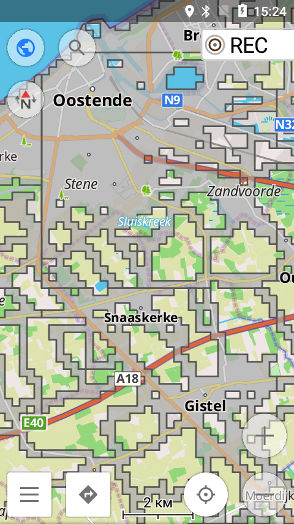

# squadrats-osmand-overlay

Minimal pipeline to turn **squadrats.com** vector tiles into an **OsmAnd** overlay (`.obf`) on Android.



*Example overlay in OsmAnd (semi-transparent gray fill, dark-gray outline).*

> Everything you need (scripts + OsmAndMapCreator folder + render style) is already **in this repository**.  
> Just install the tools below, run one script, and copy two files to your phone.

---

## Install (Windows)

1. **Java 17 (JDK)** — e.g. Eclipse Temurin 17 (LTS). `java -version` must work.  
2. **OSGeo4W** — for `ogr2ogr`. Run the build from the **OSGeo4W Shell**.  
3. **Python 3.10+** — available on `PATH` as `python`.

(OsmAndMapCreator is already included here under `OsmAndMapCreator-main/`.)

---

## Region polygon (`west_flanders.geojson`)

Any GeoJSON polygon works. Quick options:

* **Overpass Turbo** → paste → *Run* → *Export → GeoJSON*  
  ```
  [out:json][timeout:60];
  rel["admin_level"="8"]["name:en"="West Flanders"]["type"="boundary"]["boundary"="administrative"](area:3600000000);
  out ids;
  >; out skel qt;
  ```
* Draw at https://geojson.io (Save → GeoJSON).  
* Place the file in the repo root as **`west_flanders.geojson`**.

---

## Get your own **squadrats.com** tile URL

1. Open **squadrats.com**.  
2. DevTools → Network, reload, **filter by `.pbf`**.  
3. Copy a tile URL, e.g.  
   ```
   https://tiles1.squadrats.com/fiwoOW0G6oZ5Hn0eeR1TeHgc7lU2/trophies/1754233411401/12/2081/1367.pbf
   ```
4. Turn it into a template by replacing `/z/x/y.pbf` with `/{z}/{x}/{y}.pbf`, e.g.  
   ```
   https://tiles1.squadrats.com/fiwoOW0G6oZ5Hn0eeR1TeHgc7lU2/trophies/1754233411401/{z}/{x}/{y}.pbf
   ```
5. Open **`build_all_squadratinhos.bat`** and paste this template into the `BASE_URL` variable.

---

## Build (one command)

```bat
:: open OSGeo4W Shell
cd /d d:\Projects\Python\squadrats   :: or your repo path
build_all_squadratinhos.bat
```

Result: **`build\Squadratinhos.obf`**

---

## Put on phone (OsmAnd, Android)

1. Copy `build\Squadratinhos.obf` → `Android/media/net.osmand.plus/files/`  
2. Copy `squadratinhos.render.xml` → `Android/media/net.osmand.plus/files/rendering/`  
3. Restart OsmAnd → *Map style → Squadratinhos* → zoom to your area.

